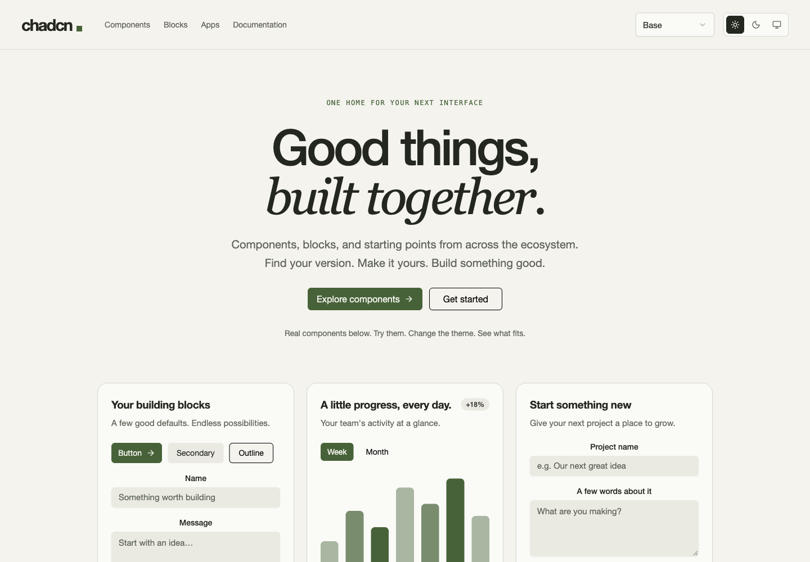

# chadcn

**Good things, built together.**

A browsable interface library for people and coding agents. Explore real components,
compare implementations from different registries, try complete app demos, and see
how the same interface looks across themes.

[Explore chadcn.dev](https://chadcn.dev) · [Agent guide](AGENTS.md) · [Machine-readable guide](https://chadcn.dev/llms.txt)



## Day one

This is an early release. The site is live and we are iterating in public. Expect
rough edges, incomplete registry coverage, and improvements to installation and
examples. A browsable demo does not automatically mean an independently installable
component, and an app demo is not a connected production service.

## Install components

The npm package and CLI are named **`chadcn-ux`**. The product is **chadcn**.
Version 0.1.0 is [available on npm](https://www.npmjs.com/package/chadcn-ux). Use:

```sh
npx chadcn-ux init
npx chadcn-ux add button card
```

Requires Node.js 22+. Version 0.1 delegates to a pinned shadcn installer: bare names
use its default registry, while registry URLs and configured namespaces select
other providers. It installs source and dependencies into your project. It does
not yet install our workspace-only compositions or every demo on the website.

```sh
npx chadcn-ux add button --dry-run
npx chadcn-ux view button
npx chadcn-ux add --help
```

See the [CLI README](packages/cli/README.md) for the exact scope and options.

## What you can explore

- **Components:** individual controls such as buttons, labels, and dropdowns.
- **Blocks:** compositions such as login forms, dialogs, sidebar layouts, plus authored studio blocks (AI chat bar, AI to-do list, schema builder).
- **Apps:** complete interface demos with navigation, settings, and working local
  interactions, including a dashboard, email client, CRM, and assistant.
- **Documentation:** library profiles, provenance, upstream links, and source references.

Duplicate names remain separate registry variants. Select the provider and example
in the preview to compare them; similar names do not imply compatible APIs.

Keep the simple Base theme, or switch to Ocean, Rose, Terminal, Rounded Neo Brutal,
Classic Brutal, Atelier, or Blueprint. Light, dark, and system modes are supported.

## For agents

Read [AGENTS.md](AGENTS.md) before changing this repository. Start with
[/llms.txt](https://chadcn.dev/llms.txt) when consuming chadcn from another project.
The guide explains installation, provider selection, checks, and current limits.
No model account or AI subscription is required to use the CLI itself.

Use explicit registry identities, inspect source before installation, and verify
real interactions. Do not treat catalog metadata as runnable UI or report local
fixtures as connected services. WebMCP browser tools support catalog search, inspection, and opening previews
when the browser exposes the API. See [WebMCP setup](docs/webmcp.md).
[Design](skills/chadcn-design/SKILL.md) and [app-building](skills/chadcn-apps/SKILL.md)
skills are included for agents. The proprietary database service is separate.

## Work on the site

The website workspace and the consumer CLI are different entry points. The
website requires Node.js 22+, Python 3, and the upstream checkouts listed in
[sources.json](sources.json). Paths and pinned revisions are recorded in
[sources.lock.json](sources.lock.json).

```sh
npm run bootstrap
npm run dev
```

Open http://127.0.0.1:4310. See [workspace setup and architecture](docs/workspace.md)
for checkout overrides, adapter generation, provenance, and update commands.

```sh
npm test
npm run typecheck
npm run check
npm run build
node --test packages/cli/test/*.test.mjs
```

`npm run check` requires the upstream checkouts and generated packages. Changes to
original upstream files are regenerated into ignored `packages/upstream-*` adapters;
edit authored source, not that generated output.

## Contributing

Small, complete improvements are welcome: fix a preview, add a usable example,
improve accessibility, or make an existing component installable. Retain original
licenses and source attribution. Describe what changed and how you verified it.

## License

chadcn-authored code, including the website and CLI, is [MIT licensed](LICENSE).
Copyright © 2026 Jason Kneen.

Upstream components, dependencies, screenshots, logos, and other third-party
material retain their respective licenses and rights. See
[THIRD_PARTY_NOTICES.md](THIRD_PARTY_NOTICES.md).
